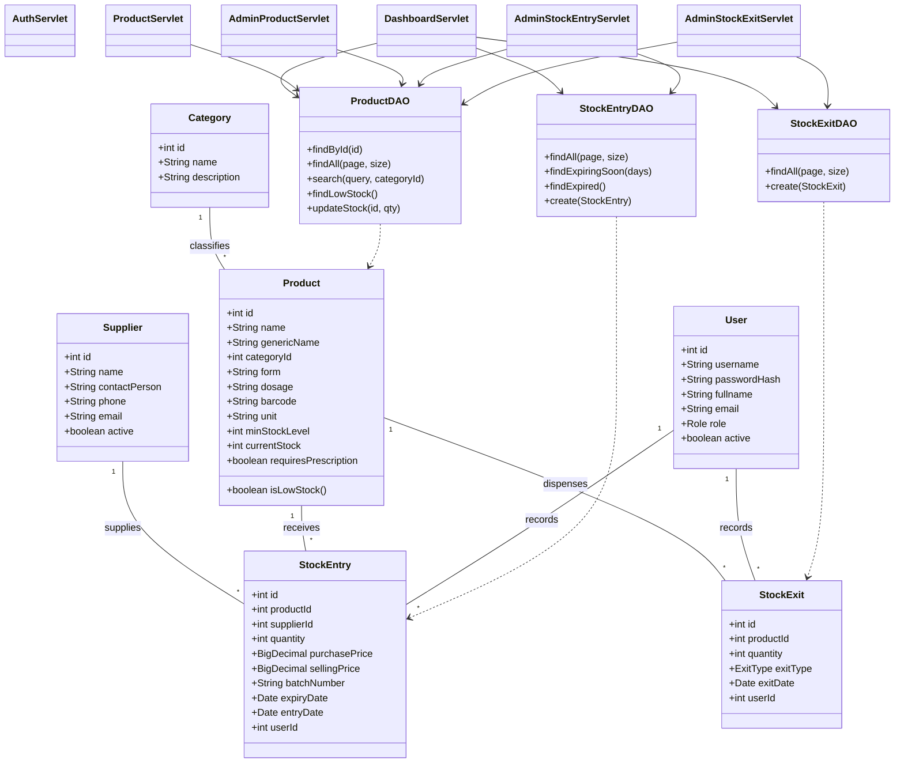
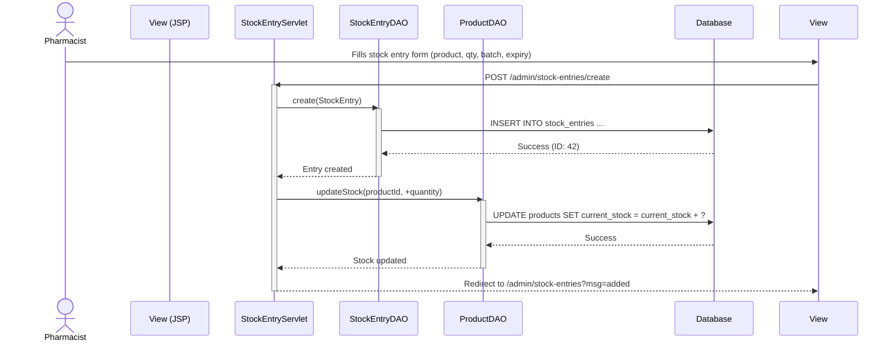
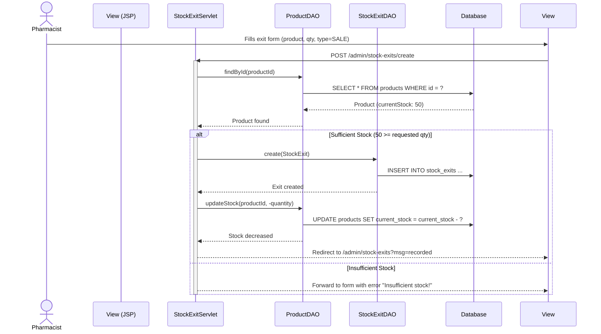
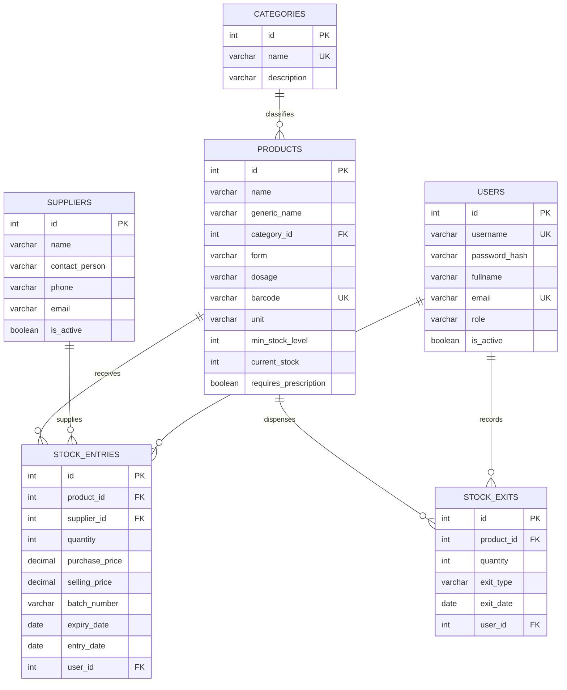

# UML Diagrams for Pharmacy Stock Management System

## Class Diagram

## Sequence Diagram: Recording Stock Entry

## Sequence Diagram: Recording Stock Exit (Sale)

## Entity Relationship Diagram

